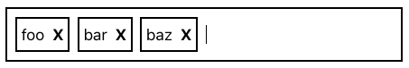
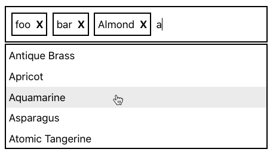

# Tags Input challenge

Duration: 1 hour (~50 minutes of coding, ~10 minutes of Q&A)

## Instructions

Create a tags input component from scratch. If there's time, add an autocomplete feature. For the autocomplete, an array of objects containing a color string will be provided for suggestions based on the input value. Given the time constraints of this exercise, things such as accessibility, best practices, and performance are not a concern. You are encouraged to ask questions and discuss trade-offs/ideas with your interviewer. The goal is to have a solution that meets all requirements by the end of the interview. You are allowed to use the internet during this process.

## Design

### Tags Input

### Tags Input with Autocomplete

## Requirements

- Must be created from scratch
  - No third party components (such as downshift or react-select), or utility libraries
- The component should:
  - Have an input that the user can type into
  - Add the current value of the input as a tag when the user presses the Enter key, and clear the current value
  - Remove a tag when it's clicked
  - Prevent duplicate tags from being added
  - All values are case-insensitive (e.g. "abc" = "ABC" = "aBc")
  - Must be styled according to the included design specification
    - Only borders, margins, and padding are necessary

## Autocomplete requirements

- Use the provided `colors.json` file for suggestion values
- Cannot use the `datalist` element
- Given an of array of objects containing a color name, offer suggestions based on the user’s input
- The suggestions should only be displayed when the user is typing in the input and if one of the suggestions matches that input
- When a suggestion is clicked, its value should be added as a tag and the current input value should be cleared
- The list of values should not contain a value already selected
- The list of values should be displayed on top of any content below the tags input
